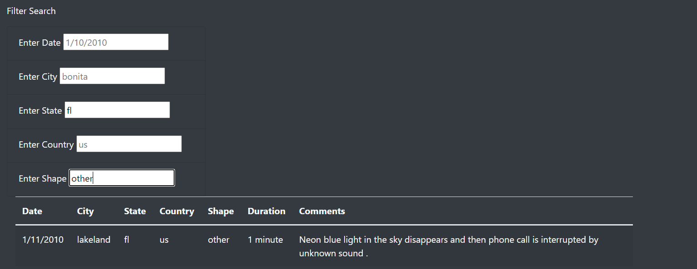
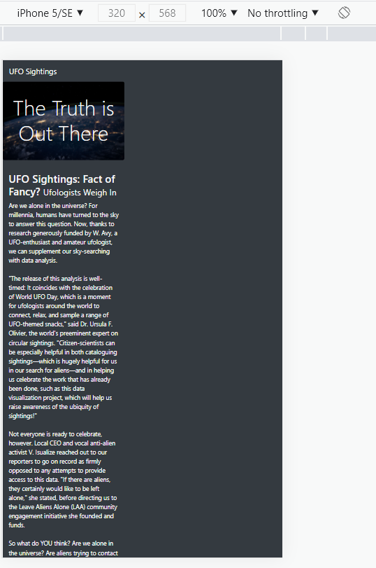

# UFOs

# Overview of the Analysis:
Dana’s webpage and dynamic table are working as intended, the purpose of this analysis is to display the new filters that have been created. The recent update provides a more in-depth analysis of UFO sightings by allowing users to filter for multiple criteria at the same time. In addition to the date, the webpage now has table filters for the city, state, country, and shape.

# Results:

The original webpage only allowed users to filter by date. the user would have to enter a date, and then press the filter button to display results. The new and improved webpage allows users to filter by date, city, state, country and shape. A user can enter in 1 or multiple filters to help them find exactly what they are searching for. Also the filter button was removed, all user have to do now to complete a search is to simply press Enter, and the table will update with their search results. 
Below is an example of the results when you search state "fl" shape "other"

# Summary:
A drawback of this webpage is that it is not user friendly across all devices. See image below of the webpage in a mobile view for iphone. As you can see the columns do not fit the screen size, this makes the webpage visually unappealing.

### Recommendations for Further Development:
- Drop down menu for certain filter fields. To help users filter through the objects
- Make the webpage user friendly across multiple devices (mobile and desktop)
